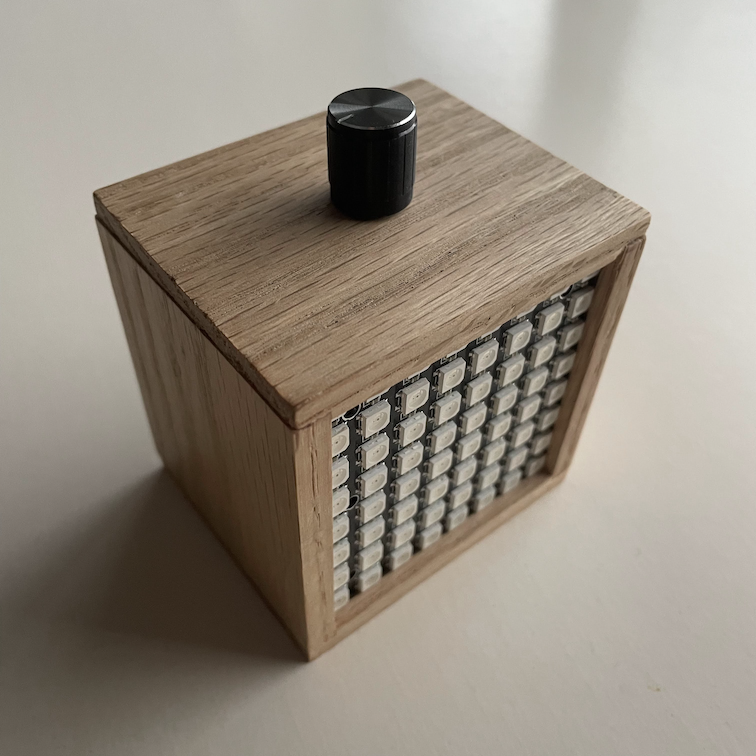
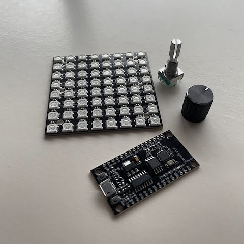
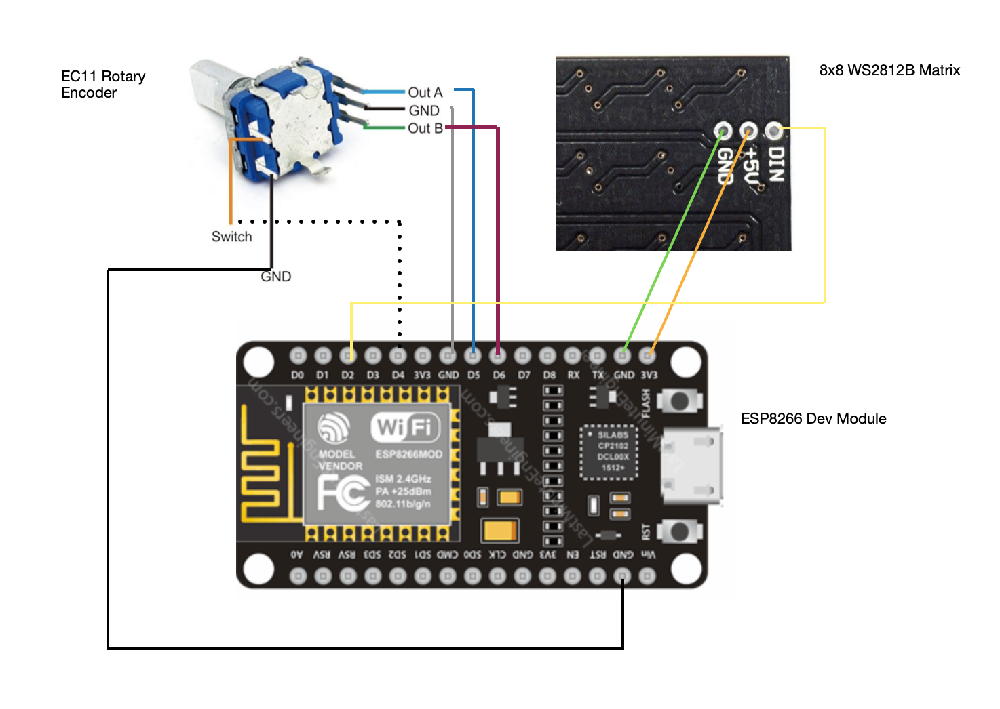
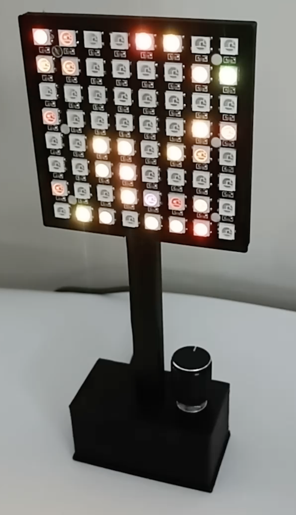

# pixel-gadget
Pixel Gadget is based on the DemoReel100 FastLED Demo by Mark Kriegsman and as modified by Andrew Tuline for button support (https://github.com/atuline/FastLED-Demos/tree/master/demoReel100_button).  The "confetti" demo is used and extended with rotary encoder support to change color, intensity (number of active pixels), brightness and ability to auto-cycle the colors or persist the current chosen color.

## User Guide:
- rotate knob to change
- push knob - it’s a button!

    - single click = cycle modes:
  { colour, intensity, 
    brightness, auto change }

    - double click = save for restart
    - long press = screen off

## 3D Printed Case:
A friend came up with this cool 3D printed case - STL files available for download.

